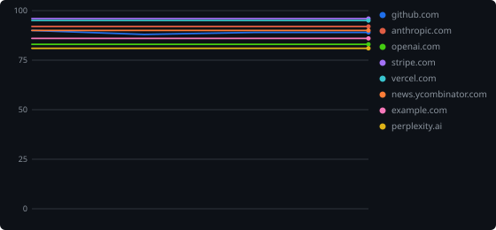
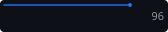
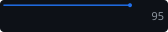
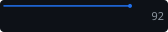
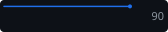
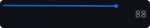
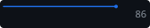
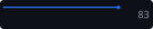
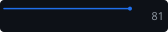

<!-- Generated by scripts/dogfood.mjs — do not edit by hand. -->
# geolint metrics — the tool on the real web

Every night [geolint](https://github.com/iliasabk/geolint) audits a fixed
list of well-known sites and commits the results back into this repo: a
living showcase of AI-search readiness scores. Pipeline:
[`.github/workflows/dogfood.yml`](../.github/workflows/dogfood.yml) →
[`scripts/dogfood.mjs`](../scripts/dogfood.mjs) → this directory.
How it works and how to change the site list:
[docs/metrics.md](../docs/metrics.md).

Last run: **2026-09-25** (UTC) · geolint v0.4.0

| Site | Score | Grade | Errors | Warnings | Trend | Last scan (UTC) |
| ---- | ----- | ----- | -----: | -------: | ----- | --------------- |
| [stripe.com](https://stripe.com) |  96/100 | A | 0 | 1 |  | 2026-09-25 |
| [vercel.com](https://vercel.com) |  95/100 | A | 0 | 2 |  | 2026-09-25 |
| [anthropic.com](https://www.anthropic.com) |  92/100 | A | 0 | 4 |  | 2026-09-25 |
| [news.ycombinator.com](https://news.ycombinator.com) |  90/100 | A | 0 | 5 |  | 2026-09-25 |
| [github.com](https://github.com) |  89/100 | B | 1 | 4 |  | 2026-09-25 |
| [example.com](https://example.com) |  86/100 | B | 1 | 6 |  | 2026-09-25 |
| [openai.com](https://openai.com) |  83/100 | B | 2 | 6 |  | 2026-09-25 |
| [perplexity.ai](https://www.perplexity.ai) |  81/100 | B | 3 | 5 |  | 2026-09-25 |

Each site has five files: `<slug>.json` (the raw
`geolint check -f json` report, or an `{ "error": "…" }` object when the
site was unreachable), `<slug>.svg` (the badge shown above),
`<slug>.endpoint.json` (a shields.io endpoint file for live external
badges), `<slug>-trend.svg` (the score sparkline) and the shared
`history.json` (rolling score history, last 90 runs per site).
